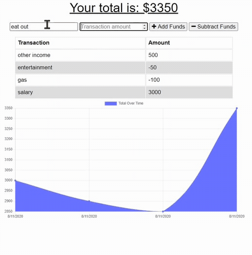

# 18: Online Offile Budget Tracker

## Application Description

This app allows users to add expenses and deposits to their budget even when there is no internet connectivity. When offline, the transactions are saved on the user's local computer and later added to the database when brought back online.  

## Table of Contents

* [Usage](#usage)
* [Credits](#Credits)
* [Homepage](#homepage)
* [Links](#links)

## Usage

1. Add a new transaction by entering the transaction name and amount.
2. Select 'Add Funds' or 'Subtract Funds' depending on if transaction is an expense or income.
3. When offline, continue entering transactions.
4. When back online, the application will automatically add your transactions to the database. 

## Credits

* Heroku documentation
* Github

## Homepage

## Links

* Github Repo: https://github.com/Waltrevino/online_offline_budget_tracker

* Heroku URL: https://oo-budget-tracker.herokuapp.com/
